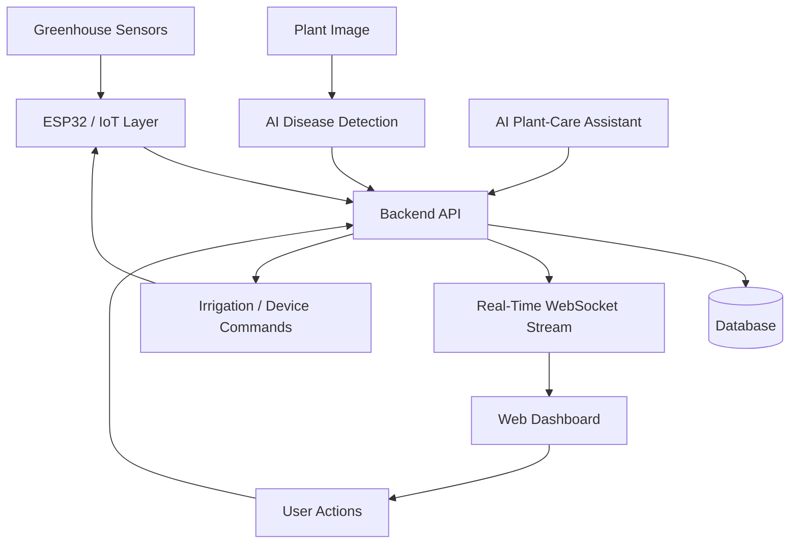
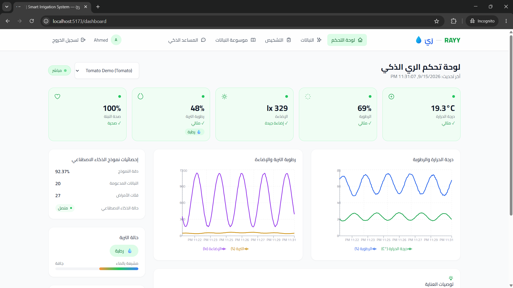
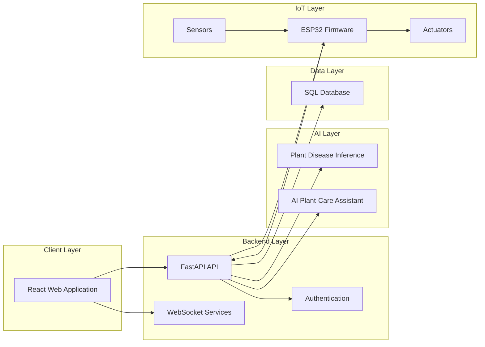

# RAYY

### Intelligent Greenhouse & Smart Agriculture Management Platform

RAYY (رَيّ) is an intelligent agriculture platform designed to connect greenhouse monitoring, smart irrigation, plant health analysis, AI assistance, and IoT devices into a unified management system.

The platform is designed to help growers monitor plant conditions, understand environmental data, manage irrigation, detect potential plant diseases, and interact with an AI-powered plant-care assistant through a modern web interface.

---

## 🌱 Project Overview

Modern greenhouse management often requires growers to monitor multiple environmental conditions and make irrigation and plant-care decisions manually.

RAYY provides a centralized platform for managing these tasks through:

- Real-time greenhouse monitoring
- Environmental sensor data
- Smart irrigation controls
- Plant health and disease analysis
- AI-assisted plant-care guidance
- Multi-plant management
- ESP32-based IoT integration
- Real-time WebSocket communication
- A Tomato Demo Simulation for testing the IoT data flow without physical hardware

The goal is to create a practical engineering platform where hardware, software, AI, and agriculture work together rather than operating as isolated components.

---

## 🎯 Why RAYY?

### The Problem

Greenhouse management can involve several disconnected tasks:

- Monitoring temperature and humidity
- Checking soil moisture
- Managing irrigation
- Identifying plant diseases
- Tracking individual plants
- Interpreting sensor readings
- Making timely plant-care decisions

When these tasks are performed manually or through disconnected systems, it becomes difficult to maintain a complete view of the greenhouse.

### The RAYY Approach

RAYY brings these capabilities together in one platform.

```text
Sensors / IoT Devices
        │
        ▼
   Data Collection
        │
        ▼
      RAYY API
        │
   ┌────┴────┐
   ▼         ▼
Database   AI Services
   │         │
   └────┬────┘
        ▼
 Web Dashboard
        │
        ▼
Monitoring • Irrigation • Diagnosis • Assistance
````

---

# ✨ Key Features

| Feature                    | Description                                                                       |
| -------------------------- | --------------------------------------------------------------------------------- |
| 🌡️ Real-Time Monitoring   | Monitor greenhouse environmental readings through the web dashboard               |
| 💧 Smart Irrigation        | Manage irrigation-related actions using plant and environmental data              |
| 🩺 AI Disease Detection    | Analyze plant images using the integrated AI inference system                     |
| 🤖 AI Plant-Care Assistant | Interact with an AI assistant for plant-care guidance                             |
| 🌱 Multi-Plant Management  | Manage individual plants and their associated information                         |
| 📡 IoT Integration         | Connect greenhouse devices through ESP32 firmware                                 |
| 🔄 WebSockets              | Receive real-time plant and sensor updates                                        |
| 🧪 Tomato Demo Simulation  | Reproduce the IoT data flow for development and testing without physical hardware |
| 🔐 Authentication          | Protected application access through the configured authentication system         |
| 📊 Dashboard               | Centralized view of greenhouse and plant information                              |

---

# 🔄 System Workflow

RAYY is structured around a continuous data flow between the greenhouse, backend services, AI components, and the user interface.



---

# 📊 Real-Time Greenhouse Dashboard

The RAYY dashboard provides a centralized interface for viewing greenhouse and plant information.

Depending on the connected system configuration, the platform can work with environmental readings such as:

* Temperature
* Humidity
* Soil moisture
* Light-related measurements
* Device status
* Plant information
* Sensor timestamps

Real-time communication is supported through the backend's WebSocket functionality.

The dashboard is designed to provide a clear operational view instead of requiring users to inspect individual sensors or devices separately.

---

# 💧 Smart Irrigation

RAYY includes irrigation-related functionality connecting the software platform with the greenhouse device layer.

The system provides the infrastructure required to:

1. Receive environmental readings.
2. Process the readings through the backend.
3. Associate information with plants and devices.
4. Trigger irrigation-related actions.
5. Communicate commands toward the IoT layer.

The exact irrigation behavior depends on the configured plants, devices, sensors, and backend logic.

RAYY therefore treats irrigation as part of an integrated greenhouse control system rather than as an isolated water-pump controller.

---

# 🩺 AI Plant Disease Detection

RAYY includes an AI-based plant image diagnosis workflow.

A user can provide a plant image through the application, after which the backend passes the image through the project's configured inference pipeline.

```text
Plant Image
    │
    ▼
Image Processing
    │
    ▼
AI Inference
    │
    ▼
Prediction
    │
    ▼
Diagnosis Result
    │
    ▼
RAYY Interface
```

The inference implementation is checkpoint/configuration driven, allowing the project to use the model configuration available in the repository rather than hard-coding an unsupported architecture claim in the documentation.

> **Important:** Model performance depends on the trained checkpoint, dataset, image quality, and inference configuration being used. RAYY does not claim a universal accuracy value independent of the deployed model.

---

# 🤖 AI Plant-Care Assistant

RAYY also includes an AI-powered plant-care assistant.

The assistant provides a conversational interface for plant-related questions and guidance.

The backend integrates with the configured Google GenAI SDK and model configuration.

Typical interaction flow:

```text
User Question
     │
     ▼
RAYY Backend
     │
     ▼
AI Assistant Service
     │
     ▼
Generated Response
     │
     ▼
Web Application
```

The exact AI model used can be configured through the project's environment settings.

---

# 🌱 Multi-Plant Management

RAYY is designed around individual plant management rather than assuming that a greenhouse contains only one plant type.

Plants can be represented individually within the application and associated with the available greenhouse data and functionality.

This architecture allows the platform to evolve toward greenhouse environments containing different crops and plant varieties.

---

# 📡 IoT / ESP32 Integration

The repository contains ESP32 firmware and IoT integration components.

The ESP32 layer is responsible for interacting with the physical greenhouse environment and communicating sensor/device information with the software platform.

A typical architecture is:

```text
┌───────────────────────────┐
│       Greenhouse          │
│                           │
│ Sensors      Pumps        │
│    │           │          │
└────┼───────────┼──────────┘
     │           │
     ▼           ▼
        ESP32
          │
          │ Network
          ▼
      RAYY Backend
          │
     ┌────┴─────┐
     ▼          ▼
 Database    WebSocket
     │          │
     └────┬─────┘
          ▼
     RAYY Dashboard
```

The presence of firmware and integration support should not be interpreted as a claim that a physical greenhouse is currently deployed in production.

---

# 🧪 Tomato Demo Simulation

RAYY includes a Tomato Demo Simulation mode intended for development, demonstration, and system testing.

The purpose of this mode is to reproduce the IoT data flow when physical greenhouse hardware is not connected.

Instead of requiring an ESP32 and physical sensors during every development session, the simulation can provide the application with a controlled stream of greenhouse-style readings.

Conceptually:

```text
Tomato Demo Simulation
          │
          ▼
   Simulated IoT Readings
          │
          ▼
      RAYY Backend
          │
          ▼
   WebSocket / Database
          │
          ▼
     Live Dashboard
```

This allows the complete software communication path to be tested before connecting physical greenhouse hardware.

The simulation is therefore a **demonstration and testing mode for the IoT pipeline**, not a replacement for physical greenhouse deployment.

---

# 🖼️ Screenshots

## Landing Page

The RAYY landing page introduces the platform and its main capabilities.


---

## Greenhouse Dashboard

The dashboard provides the main operational interface for monitoring plants and greenhouse information.



---

## AI Disease Detection

The diagnosis interface provides the workflow for submitting plant images for AI-based analysis.


---

## AI Plant-Care Assistant

The assistant provides a conversational interface for plant-care interaction.


---

# 🏗️ System Architecture

RAYY follows a layered architecture separating the user interface, backend services, data persistence, AI functionality, and device integration.



---

# 🧰 Technology Stack

The current repository uses the following technologies and frameworks.

| Layer                    | Technology                  |
| ------------------------ | --------------------------- |
| Frontend                 | React                       |
| Language                 | TypeScript                  |
| Build Tool               | Vite                        |
| Styling                  | Tailwind CSS                |
| Data Fetching            | TanStack Query              |
| Backend                  | FastAPI                     |
| Backend Language         | Python                      |
| ORM                      | SQLAlchemy                  |
| Migrations               | Alembic                     |
| Database                 | SQLite / PostgreSQL support |
| Real-Time Communication  | WebSockets                  |
| AI Vision                | PyTorch / TorchVision       |
| AI Assistant             | Google GenAI SDK            |
| IoT                      | ESP32                       |
| Firmware Framework       | PlatformIO                  |
| Authentication           | Supabase token verification |
| Containerization         | Docker                      |
| Deployment Configuration | Vercel / Railway / Render   |

---

# 🔐 Authentication

RAYY includes authentication functionality in the application and backend.

The backend supports authentication through the configured Supabase authentication/token verification setup.

Authentication-related configuration is supplied through environment variables rather than being hard-coded into the repository.

> Never commit private authentication credentials, service-role keys, OAuth secrets, database passwords, or other sensitive configuration values.

---

# 🔌 API Overview

The backend exposes REST API functionality for the main platform services.

The project includes API areas for functionality such as:

* Authentication-related operations
* Plant management
* Plant diagnosis
* Diagnosis history
* Disease reports
* Sensor/device functionality
* Irrigation/device commands
* Real-time plant data

The exact routes and request/response schemas are defined by the FastAPI application in the repository.

When developing against the API, use the backend's automatically generated documentation where available.

Typical FastAPI documentation endpoints are:

```text
/docs
/redoc
```

For example, when running the backend locally:

```text
http://localhost:8000/docs
```

The API documentation generated by FastAPI should be treated as the authoritative reference for the current endpoint schemas.

---

# 📁 Project Structure

The repository is organized into separate application layers.

```text
RAYY/
│
├── ai/
│   └── AI / model-related components
│
├── backend/
│   └── FastAPI backend services
│
├── docs/
│   └── Project documentation and screenshots
│
├── firmware/
│   └── ESP32 / IoT firmware
│
├── frontend/
│   └── React + TypeScript web application
│
├── sensors data/
│   └── Sensor-related project data
│
├── utils/
│   └── Utility components and supporting functionality
│
├── docker-compose.yml
├── Dockerfile
├── README.md
└── ...
```

The exact contents may evolve as the project develops.

---

# 🚀 Quick Start

## Prerequisites

Install the required development tools before starting:

* Git
* Node.js
* npm
* Python 3.x
* pip
* PlatformIO if working with the ESP32 firmware

---

## 1. Clone the Repository

```bash
git clone https://github.com/AhmedDev374/RAYY.git
cd RAYY
```

---

## 2. Frontend Setup

Navigate to the frontend directory:

```bash
cd frontend
```

Install dependencies:

```bash
npm install
```

Configure the required environment variables according to the frontend environment configuration.

Start the development server:

```bash
npm run dev
```

The Vite development server will provide the local frontend URL in the terminal.

---

## 3. Backend Setup

From the project root, create a Python virtual environment:

### Windows

```powershell
python -m venv .venv
.venv\Scripts\Activate.ps1
```

### Linux / macOS

```bash
python3 -m venv .venv
source .venv/bin/activate
```

Install the backend dependencies according to the project's dependency file.

Then start the FastAPI application using the project's configured application entry point.

A typical development command is:

```bash
python -m uvicorn app.main:app --reload --port 8000
```

> Use the actual backend entry point present in your checkout if it differs from the example above.

---

# ⚙️ Environment Variables

RAYY uses environment variables for configuration and sensitive integration values.

Do **not** place actual credentials in `README.md`.

Typical configuration areas include:

| Configuration Area           | Purpose                                         |
| ---------------------------- | ----------------------------------------------- |
| Frontend Supabase URL        | Connect frontend authentication/services        |
| Frontend Supabase public key | Client-side Supabase configuration              |
| Backend database URL         | Database connection                             |
| Supabase configuration       | Backend authentication/token verification       |
| Google GenAI configuration   | AI assistant integration                        |
| AI model configuration       | Configure the vision inference checkpoint/model |
| CORS configuration           | Control permitted frontend origins              |
| Device configuration         | Configure IoT communication                     |

Use the environment templates/configuration files included in the repository as the source of truth for the exact variable names required by the current implementation.

### Security Rule

Never commit:

```text
API keys
Access tokens
Passwords
OAuth secrets
Database credentials
Supabase service-role keys
Private keys
Production secrets
```

If a secret is accidentally committed, revoke/rotate it immediately.

---

# ☁️ Deployment

The repository contains deployment configuration for cloud/container-based environments.

Deployment support is organized around the project's existing configuration for:

* Vercel
* Railway
* Render
* Docker

The exact deployment process depends on the selected hosting provider and the environment variables configured for that deployment.

Before deploying, configure all required environment variables through the hosting provider's secret/environment configuration system.

Do not commit production secrets to the repository.

---

# 🔒 Security

Security is an important part of the RAYY architecture.

The project separates application configuration from sensitive credentials through environment variables.

Recommended practices:

* Never commit API keys.
* Never commit passwords.
* Never expose database credentials.
* Never commit Supabase service-role keys.
* Use environment variables for secrets.
* Restrict CORS origins in production.
* Use HTTPS for production deployments.
* Rotate credentials if they are accidentally exposed.
* Keep dependencies updated.
* Use authentication for protected application functionality.

---

# 🧭 Future Development

RAYY is structured so that additional greenhouse capabilities can be added over time.

Potential development directions include:

* Expanded crop support
* More plant disease categories
* Improved model training and evaluation
* Additional environmental sensors
* Automated irrigation strategies
* More advanced greenhouse automation
* Historical environmental analytics
* Plant growth tracking
* More sophisticated alerts
* Additional IoT devices
* Improved AI-assisted recommendations
* Hardware validation in real greenhouse environments

These represent future development directions and should not be interpreted as currently implemented functionality.

---

# 📄 License

No license file is currently included in the repository.

Until an explicit license is added, the repository should not be assumed to grant permission to redistribute, modify, or commercially use the project's source code.

---

# 👨‍💻 Author

**AhmedDev374**

GitHub:

[https://github.com/AhmedDev374/](https://github.com/AhmedDev374/)